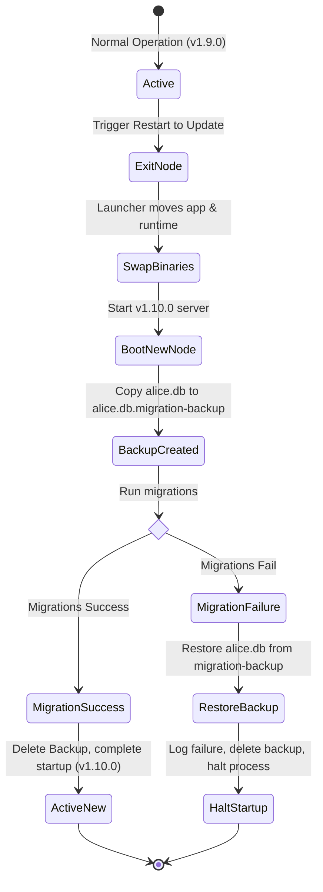

# Data Model and Schema Specification: Self-Update Support

## 1. Instance Lock File Schema (`data/alice.lock`)

The instance lockfile is a transient JSON file written at startup and deleted on graceful shutdown. It coordinates single-instance launch logic and update sequence locks.

```json
{
  "$schema": "http://json-schema.org/draft-07/schema#",
  "title": "InstanceLock",
  "type": "object",
  "properties": {
    "version": {
      "type": "integer",
      "description": "Lockfile format schema version. Facilitates future launcher backward compatibility.",
      "minimum": 1
    },
    "appVersion": {
      "type": "string",
      "description": "The SemVer string of the running instance (e.g., '1.9.0')."
    },
    "pid": {
      "type": "integer",
      "description": "The Process ID (PID) of the active Express server."
    },
    "port": {
      "type": "integer",
      "description": "The local port bound by the Express server.",
      "minimum": 1024,
      "maximum": 65535
    },
    "launchTime": {
      "type": "string",
      "format": "date-time",
      "description": "ISO 8601 timestamp of when the instance was booted."
    }
  },
  "required": ["version", "appVersion", "pid", "port", "launchTime"]
}
```

---

## 2. Update Configuration Schema (`config/settings.json`)

Update behavior configuration is stored locally under `config/settings.json` alongside launch settings (`port`, `openBrowser`).

```json
{
  "$schema": "http://json-schema.org/draft-07/schema#",
  "title": "LaunchSettingsAndUpdates",
  "type": "object",
  "properties": {
    "port": {
      "type": "integer",
      "default": 3001
    },
    "openBrowser": {
      "type": "boolean",
      "default": true
    },
    "autoCheckUpdates": {
      "type": "boolean",
      "default": true,
      "description": "Controls whether Alice periodically checks GitHub for new releases."
    },
    "updateMode": {
      "type": "string",
      "enum": ["notify", "ask", "auto"],
      "default": "ask",
      "description": "Update modes: 'notify' (only badge available releases), 'ask' (notify and prompt download), 'auto' (download in background and prompt restart)."
    }
  }
}
```

---

## 3. Database Migration Backup State Transition

During updates, the SQLite database (`data/alice.db`) changes state as follows:


